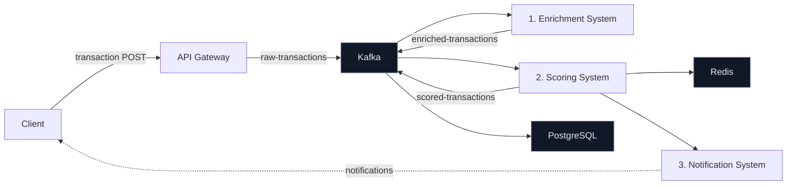

# ATLAS - Fraud Alert Triage & Escalation Platform

A distributed, AI-powered fraud detection system with intelligent operational management.

## Overview

ATLAS implements a fraud detection platform that combines real-time transaction processing, AI-assisted operational management, and automated scaling capabilities. The system is designed for high-reliability environments with strict safety and observability requirements.

## Architecture

### Core System Components

- **API Gateway**: FastAPI-based ingress point with rate limiting and metrics
- **Kafka Message Broker**: Event-driven communication backbone
- **Transaction Client**: Transaction generator for testing
- **Evaluation System**: Kafka consumer with fraud detection logic
- **PostgreSQL Database**: Transaction storage and analysis
- **Prometheus Monitoring**: Metrics collection and alerting

### Agentic Operational Layer

- **Scaling Agent**: Centralized autoscaling orchestration for Kubernetes and MCP/HTTP operator workflows
- **Operational Safety**: Human-in-the-loop decision making
- **Metrics-Driven Actions**: Automated responses to system conditions
- **MCP Tooling**: Local stdio-based tool server for Prometheus and Kubernetes operations

## Key Features

### Fraud Detection Pipeline
1. **Transaction Ingestion**: Real-time transaction processing via REST API
2. **Event Streaming**: Kafka-based decoupling for scalability
3. **Fraud Analysis**: AI-powered evaluation with historical context
4. **Database Storage**: PostgreSQL for transaction persistence

### Intelligent Operations
- **Auto-Scaling**: Feed-forward orchestration scales the full processing pipeline from a global ingress load indicator
- **Load Monitoring**: Real-time metrics from Prometheus
- **Safety Boundaries**: Configurable thresholds with human oversight
- **Operational Visibility**: Comprehensive logging and alerting

## Data Flow & Technical Components

### Transaction Processing Pipeline



### Component Details

**API Gateway** (`gateway/gateway.py`)
- FastAPI-based entry point exposing `/api/v1/transactions` (POST)
- Health probes: `/health/live` (liveness), `/health/ready` (readiness with Kafka check)
- Prometheus metrics exposed on `/metrics`
- Rate limiting and graceful degradation: Readiness probe holds traffic until Kafka is ready
- Exponential backoff retry logic for Kafka connection

**1. Enrichment System** (`enrichment-system/enrichment_system.py`)
- Consumes JSON from `raw-transactions` topic
- Performs GeoIP localization using MaxMind GeoLite2 database (`FastIPLocator`)
- Extracts payment details, user context, and transaction metadata
- Produces enriched payloads to `enriched-transactions` topic
- Health probes: `localhost:8080/health` and `localhost:8080/ready`

**2. Scoring System** (`scoring-system/scoring.py`)
- Consumes JSON from `enriched-transactions` topic
- Uses Confluent Schema Registry for Avro serialization
- Maintains Redis-backed state for user risk history and transaction patterns
- Risk evaluation engine computes fraud probability and assigns risk levels
- Produces Avro-serialized records to `scored-transactions` topic
- Health probes: `localhost:8080/health` and `localhost:8080/ready`

**3. Notification System** (`notification-system/notification_broker.py`)
- Consumes Avro-serialized messages from `scored-transactions` topic
- Defensive decoding: Attempts Avro deserialization, falls back to UTF-8 with replacement for corrupted bytes
- Publishes notifications to `transaction-notifications` topic for downstream consumers
- Graceful handling of encoding mismatches and mixed-format messages

**Data Storage**
- PostgreSQL: Persists transaction history via Kafka Connect sink (JDBC connector)
- Redis: Maintains in-memory state for scoring engine (user profiles, pattern cache)
- Kafka: Durable event log for transaction pipeline (retention configurable)

### Kafka Topics & Consumer Groups

| Topic | Producer | Consumer(s) | Format | Retention |
|-------|----------|------------|--------|-----------|
| `raw-transactions` | API Gateway | Enrichment System | JSON | 7 days |
| `enriched-transactions` | Enrichment System | Scoring System | JSON | 7 days |
| `scored-transactions` | Scoring System | Notification System, Kafka Connect Sink | Avro | 7 days |
| `transaction-notifications` | Notification System | Client subscribers | JSON | 3 days |

### Infrastructure Components

**Redis** (`atlas-redis`)
- State management for scoring engine
- User risk profiles and historical patterns
- Connection pooling and timeouts configured

**PostgreSQL** (`atlas-postgres`)
- Transaction history storage
- Indexed on `transaction_id`, `user_id`, `timestamp`
- Initialized with schema from `postgres/init.sql`
- Credentials managed via Kubernetes secrets

**Schema Registry** (`schema-registry`)
- Avro schema versioning and validation
- Used by scoring system for serialization
- Used by notification system for deserialization

### Monitoring & Observability

**Prometheus Metrics**
- API Gateway: HTTP request rate, latency, error rates (via `prometheus-fastapi-instrumentator`)
- Scaling Agent: Deployment replica counts, RPS measurements
- All services: Kubernetes pod metrics (CPU, memory, restarts)

**Alert Rules** (`k8s/plt-layer/prometheus-rules.yaml`)
- `HighErrorRate`: Error rate > 5% for 2 minutes (critical)
- `HighLatency`: p90 latency > 2s for 2 minutes (warning)
- `CPUSaturation`: CPU usage > 85% of limit (warning)
- `PodCrashLooping`: Pod restarted > 2.5x in 3 minutes (critical)
- All alerts trigger with `trigger: agent_sre` label for Guardian routing

**Health Probes Pattern**
- **Liveness** (`/health/live`): Always returns 200; indicates pod is alive
- **Readiness** (`/health/ready`): Returns 503 if critical dependencies (Kafka, PostgreSQL) are unavailable; gates traffic admission

### Horizontal Pod Autoscaler (HPA)

Each microservice has an HPA configured with CPU-based scaling:
- `api-gateway`: 1–2 replicas, 60% CPU target
- `enrichment-system`: 1–2 replicas, 60% CPU target
- `scoring-system`: 1–2 replicas, 60% CPU target
- `notification-system`: 1–2 replicas, 60% CPU target

Scaling behaviors:
- **Scale-up**: Immediate, up to 100% per minute
- **Scale-down**: 120-second stabilization window to prevent flapping

## Kubernetes Architecture

### Service Discovery & Networking

**ClusterIP Services**
- `api-gateway:8000` - REST endpoint for transaction ingestion
- `enrichment-system:8080` - Health probes (internal)
- `scoring-system:8080` - Health probes (internal)
- `notification-system:8080` - Health probes (internal)
- `atlas-kafka-broker:9092` - Kafka bootstrap servers
- `atlas-redis-master:6379` - Redis state store
- `atlas-postgres-postgresql:5432` - PostgreSQL database
- `schema-registry:8081` - Confluent Schema Registry

**Ingress Routes** (NGINX Controller required)
- `http://fraud-api.127.0.0.1.nip.io` → `api-gateway:8000` (transaction API)
- `http://locust.127.0.0.1.nip.io` → `locust-master-ui:8089` (load testing UI)
- `http://guardian-report.127.0.0.1.nip.io` → `atlas-guardian-dashboard-service:8501` (incident dashboard)

**Pod Naming Convention**
- `{deployment-name}-{hash}-{pod-id}` (e.g., `api-gateway-abc123-xyz789`)

### ConfigMaps & Secrets

**ConfigMap: `fraud-detection-config`**
- Shared environment variables across all compute-layer deployments
- Contains Kafka broker, Redis, PostgreSQL connection strings
- Mounted as `envFrom` in pod specs

**Secrets**
- `llm-credentials`: `LLM_API_KEY` (auto-created by deploy.sh; use the following command manually when deploying via API)

  ```bash
  kubectl create secret generic llm-credentials --from-literal=LLM_API_KEY="YOUR_API_KEY" --dry-run=client -o yaml | kubectl apply -f -
  ```

- `postgres-credentials`: `DATABASE_URL` (auto-created by deploy.sh)
- `grafana-mcp-credentials`: Grafana API token (auto-created during deployment)

### Resource Requests & Limits

All deployments follow Kubernetes best practices:
- **Requests**: CPU and memory guaranteed for scheduling
- **Limits**: CPU and memory caps to prevent node starvation
- **Example** (API Gateway):
  - Request: 100m CPU, 128Mi memory
  - Limit: 500m CPU, 512Mi memory

### StatefulSets (Data Layer)

- `atlas-kafka-controller`: Kafka brokers (ordered pod identity, stable storage)
- `atlas-postgres-postgresql`: PostgreSQL primary (stable DNS, persistent volume)
- `atlas-redis-master`: Redis instance (ordered pod identity)

### Kind Cluster Configuration

For local testing with `deploy_kind.sh`:
- **Cluster Name**: `fraud-detection-lab`
- **Config File**: `k8s/kind-config.yaml`
- **NGINX Ingress**: Auto-installed from upstream Kubernetes Ingress repo
- **Node Port Exposure**: Kind automatically maps container ports for nip.io routing

### System Requirements & Operational Profile

- **Target Scale**: Production fraud detection systems processing high transaction volumes
- **Operational Priorities**: Correctness, safety, auditability, automated remediation
- **SLA**: 99.99% uptime target, sub-second response times for transaction ingestion

### Recent Platform Improvements
- **Orchestrator Runtime**: Consolidated scaling into a single-loop, multi-deployment LangGraph workflow that evaluates `api-gateway`, `scoring-system`, `enrichment-system`, and `notification-system` sequentially
- **Tooling Separation**: The scaling runtime keeps the MCP tool server local and speaks to Kubernetes and Prometheus through typed tool calls
- **Alerting Resilience**: The notification service handles Avro-serialized scored events with graceful fallback decoding for local and mixed-format environments
- **Operational Guardrails**: Safety checks, approval gates, and replica limits are enforced in the scaling path to keep automated actions auditable
- **Human-Approved Scaling**: The Guardian now requires an approved request before `/approvals/{id}/execute` will scale a workload, and temporary HPA max-replica increases are recorded with `guardian.temp_*` annotations so the cluster can revert back to normal HPA control when load drops

## Quick Start

### Prerequisites
- Docker & Docker Compose
- Python 3.11+
- 16GB RAM minimum

### Local Development
```bash
# Start the local stack for development
docker compose up --build

# Access points
# - API Gateway: http://localhost:8000
# - Prometheus: http://localhost:9090
# - Scaling Agent HTTP API: http://localhost:8001
# - Scaling Agent metrics: http://localhost:8002/metrics
```

### Kubernetes Deployment
The production-style deployment path uses Kubernetes and the repository deploy scripts, not Docker Compose alone.

Use `deploy.sh` to launch the full pipeline on a Kubernetes cluster:

```bash
bash deploy.sh --build
```

This script builds the service images, deploys the data layer, installs the platform observability stack, applies the application manifests, creates required secrets, and waits for rollouts to complete.

Useful options:
- `--skip-data-layer` to reuse existing Kafka, Redis, and PostgreSQL services
- `--skip-plt` to reuse the monitoring stack
- `--skip-app-layer` to deploy only the infrastructure layers
- `--skip-locust` to skip the load-testing resources
- `--namespace <name>` to target a different Kubernetes namespace

For local kind clusters, use:

```bash
bash deploy_kind.sh --build
```

### Test Transaction Flow
```bash
# Send test transaction
curl -X POST http://localhost:8000/api/v1/transactions \
  -H "Content-Type: application/json" \
  -d '{"transaction_id": "test-123", "timestamp": "2026-03-23T10:00:00Z", "channel": "web", "transaction_type": "payment", "payment_details": {"amount": 100.0, "currency": "EUR", "payment_method": "credit_card"}, "user_id": 123}'
```

## Load Testing with Locust

Use `locust/locustfile.py` to stress the FastAPI gateway endpoint `/api/v1/transactions`.

### Transaction Client
- Runs as Docker service `transaction-client` (when using `docker-compose.yml`)
- Generates continuous traffic to `/api/v1/transactions` at a configurable rate
- Independent of Locust; provides baseline load even without explicit load testing
- Useful for continuous validation during development

### Important Behavior
- The Docker service `transaction-client` and Locust are independent traffic generators.
- If you do not start Locust, the system still receives traffic from `transaction-client` (if running in Compose).
- If you run both together, the gateway receives combined traffic.

### Option 1: Run Locust Locally
```bash
# Start platform services
docker compose up -d --build

# Install Locust locally (one-time)
pip install locust

# Start Locust UI
locust -f locust/locustfile.py --host=http://localhost:8000
```

Open the Locust UI at `http://localhost:8089`.

### Option 2: Run Locust in Docker
```bash
docker run --rm -it --network host -v "$PWD":/mnt/locust locustio/locust \
  -f /mnt/locust/locust/locustfile.py --host=http://localhost:8000
```

### Option 3: Run Locust Against Kubernetes Ingress
Use this option when ATLAS is deployed on Kubernetes.

Prerequisites:
- NGINX Ingress Controller installed and running in the cluster
- Ingress resource `api-gateway-ingress` applied

Run Locust against the ingress host:

```bash
locust -f locust/locustfile.py --host=http://fraud-api.127.0.0.1.nip.io
```

Quick verification before starting Locust:

```bash
python3 - <<'PY'
import urllib.request
with urllib.request.urlopen('http://fraud-api.127.0.0.1.nip.io/health/live', timeout=3) as r:
    print(r.status)
    print(r.read().decode())
PY
```

If ingress is not available yet, use temporary port-forward fallback:

```bash
kubectl port-forward -n default svc/api-gateway 8000:8000
locust -f locust/locustfile.py --host=http://localhost:8000
```

### Headless Example (CI-friendly)
```bash
locust -f locust/locustfile.py --host=http://localhost:8000 --headless -u 100 -r 10 -t 5m
```

### Isolating Locust Metrics (without built-in client traffic)
```bash
# Keep all services but disable the mock transaction client
docker compose up -d --build --scale transaction-client=0
```

## SRE Guardian & Trend Reporting

The platform uses the `agents-devops` SRE Guardian runtime for alert intake, investigation, remediation reasoning, and post-mortem reporting, combined with the Trend Reporting Agent for incident pattern analysis.

The guardian workflow is built around an explicit control loop with tool-call execution, human-approval checkpoints, and deployment-by-deployment reasoning so that actions remain explainable and reviewable.

### Guardian Container
- Runs from `agents-devops/main_agent_guardian.py`
- Exposes a FastAPI webhook on port `8000`
- Spawns `agents-devops/k8s_mcp.py` locally over stdio for Kubernetes control
- Investigates alerts with Grafana MCP and executes remediation reasoning with LangGraph
- Kubernetes deployment is defined in `k8s/app-layer/agent-guardian.yaml`, which bundles the ServiceAccount, RoleBinding, initContainer wait-for-Grafana-MCP step, budget env vars, and the dashboard sidecar deployment

### Trend Reporting Agent
- **Multi-process orchestration** via `agents-devops/entrypoint.sh`:
  - `uvicorn main_agent_guardian:app` on port `8000` (FastAPI webhook)
  - `python src/agent_trend/health_server.py` on port `8002` (liveness + readiness probes)
  - `streamlit run src/agent_trend/dashboard.py` on port `8501` (interactive post-mortem dashboard)
- **Dashboard features**:
  - Real-time incident visualization via Streamlit
  - Trend analysis with LLM-generated insights
  - Exposed through Kubernetes ingress at `http://guardian-report.127.0.0.1.nip.io`

## Chaos Engineering

### Chaos Agent

The Chaos Agent serves as the **Red Team** within ATLAS, executing controlled chaos experiments to validate the resilience of the platform and the effectiveness of the Guardian's automated remediation.

- **Runtime**: Runs from `agents-chaos/main_chaos_agent.py`
- **FastAPI Interface**: Exposes `/trigger-chaos` endpoint for on-demand resilience testing
- **Execution Model**: Four-phase chaos engineering workflow orchestrated by LangGraph:
  1. **Discovery**: Enumerate target deployments and system state
  2. **Planning**: Design targeted failure scenarios with clear objectives
  3. **Execution**: Apply controlled disruptions (pod termination, resource starvation, network delays)
  4. **Analysis**: Collect remediation responses and produce formal Markdown reports
- **MCP Tool Ecosystem**: Kubernetes operations (`kill_random_pod`, `get_target_deployments`, network policies) exposed via local stdio MCP server
- **Output**: Structured incident reports detailing experiment outcomes, detection latency, and remediation effectiveness

### Triggering Chaos Experiments

```bash
# Trigger a chaos experiment against a specific deployment
curl -X POST http://localhost:8000/trigger-chaos \
  -H "Content-Type: application/json" \
  -d '{"target_deployment": "api-gateway", "objective": "Verify auto-scaling response to pod failures"}'
```

### Configuration & Environment Variables

**Guardian Runtime Variables**:
- `TARGET_DEPLOYMENTS`: Kubernetes deployments to monitor (default: `api-gateway,scoring-system,enrichment-system,notification-system`)
- `NAMESPACE`: Kubernetes namespace (default: `default`)
- `LM_STUDIO_URL` / `LLM_API_URL`: OpenAI-compatible LLM endpoint
- `LLM_MODEL` / `LM_MODEL`: Model name to use (e.g., `gpt-4`, `google/gemma-3-12b`)
- `LLM_API_KEY`: API key (or "local-no-key" for local models)
- `DATABASE_URL`: PostgreSQL connection string (required)
- `BUDGET_MAX_REPLICAS`: per-deployment ceiling used to derive the default global budget
- `TOTAL_REPLICA_BUDGET`: maximum allowed replica sum across all target deployments
- `EMERGENCY_MAX_REPLICAS`: absolute upper bound for emergency actions, clamped to the configured budget
- `MAX_TOOL_STEPS`: Maximum reasoning steps per incident (default: `10`)
- `RPS_REPLICA_THRESHOLDS`: Comma-separated RPS thresholds for scaling bands (default: `5,15,30,60`)
- `REPORTS_DIR`: Output directory for incident reports

**Chaos Agent Runtime Variables**:
- `TARGET_DEPLOYMENTS`: Kubernetes deployments eligible for chaos experiments (default: `api-gateway,scoring-system,enrichment-system,notification-system`)
- `LM_STUDIO_URL` / `LLM_API_URL`: OpenAI-compatible LLM endpoint for the chaos reasoning loop
- `LLM_MODEL`: Model name for chaos planning and analysis
- `LLM_API_KEY`: API key for the chaos LLM
- `MAX_TOOL_STEPS`: Maximum steps in the chaos experiment workflow (default: `6`)
- `REQUEST_TIMEOUT_SECONDS`: Timeout for individual chaos tool calls (default: `90`)
- `LOG_LEVEL`: Logging level (default: `INFO`)

**Validation**:
- Guardian: `DATABASE_URL` and either `LLM_API_URL` or `LM_STUDIO_URL` are required at startup
- Guardian scaling actions are blocked when the projected total replica usage exceeds `TOTAL_REPLICA_BUDGET`
- Chaos Agent: `LLM_API_URL` or `LM_STUDIO_URL` required for LLM reasoning
- Missing required variables cause immediate failure with clear error messages
- Config validation runs at module import time

### Runtime Behavior
- FastAPI accepts Alertmanager webhooks immediately and processes firing alerts in background tasks
- Duplicate alerts are deduplicated with `ALERT_DEDUP_WINDOW_SECONDS`, and concurrent runs for the same deployment are serialized with an in-flight lock
- Reports are written to `reports/incidents/` and upserted by incident key, so repeated alerts update the same incident record
- Incident reports store `incident_id`, `post_mortem_path`, and structured execution details for later review
- The dashboard is exposed through ingress at `http://guardian-report.127.0.0.1.nip.io`
- The webhook endpoint stays internal to the cluster at `http://atlas-guardian-service.default.svc.cluster.local:8000/webhook`
- Health probes on port `8002` allow Kubernetes to monitor pod readiness and restart unhealthy instances

### LM Studio Support
- `LM_STUDIO_URL`, `LMSTUDIO_BASE_URL`, or `LLM_API_URL` point to the OpenAI-compatible local model server
- `LM_MODEL` or `LMSTUDIO_MODEL` should match the exact model name exposed by LM Studio, such as `google/gemma-3-12b`
- The Kubernetes manifest uses `http://host.docker.internal:1234/v1` in Docker Desktop
- Invalid model output is handled safely inside the client loop

### Development
- Update `deploy.sh` when the Kubernetes launch sequence changes
- Update `deploy_kind.sh` when the kind-specific launch sequence changes
- Update `agents-devops/k8s_mcp.py` when you need new Kubernetes tools
- Update `agents-devops/src/agent_trend/trend_analyzer.py` for incident trend analysis logic
- Update `agents-devops/src/agent_trend/dashboard.py` for dashboard UI changes
- Update `agents-devops/entrypoint.sh` when changing process orchestration (uvicorn, health server, streamlit)
- Update `k8s/app-layer/agent-trend-report.yaml` for Kubernetes deployment configuration
- Update `agents-chaos/chaos_mcp.py` to add new chaos operations or Kubernetes tools
- Update `agents-chaos/src/agent_chaos/prompts.py` for new chaos strategies or target profiles
- Update `k8s/app-layer/agent-chaos.yaml` for chaos agent deployment configuration

## MCP Tools & Agent Capabilities

### Scaling Agent Tools (`agents-devops/k8s_mcp.py`)

Tools exposed to the Guardian reasoning loop for autonomous decision-making:

- **`get_rps`** - Query Prometheus for global ingress RPS via PromQL, returns float value
- **`get_current_replicas`** - Fetch current replica count for a deployment
- **`set_replicas`** - Update replica count for a deployment (respects `MIN_REPLICAS` / `MAX_REPLICAS` guardrails)
- **`get_scaling_recommendation`** - Combine current load and replica state into a suggested action (SCALE_UP, SCALE_DOWN, HOLD)
- **`get_workload_health`** - Query Prometheus for workload health metrics (error rates, latency, CPU)
- **`get_hpa_limits`** - Read HPA limits together with the configured budget and emergency ceilings
- **`get_budget_state`** - Inspect global replica usage, remaining budget, and per-deployment costs
- **`plan_budget_allocation`** - Compute a budget-safe allocation plan before scaling up a target deployment
- **`execute_budget_allocation`** - Apply the allocation plan atomically with rollback safeguards
- **`set_hpa_max_replicas`** - Update the HPA ceiling for a deployment when pressure drops
- **`restore_cpu_limits`** - Restore CPU limits when the verdict is infrastructure-related rather than scaling-related

All tools return structured JSON responses with validation and error handling.

### Chaos Agent Tools (`agents-chaos/chaos_mcp.py`)

Tools for executing controlled failure injection:

- **`get_target_deployments`** - List eligible Kubernetes deployments for chaos experiments
- **`kill_random_pod`** - Terminate a random pod in a target deployment (simulates pod crash)
- **`inject_network_delay`** (future) - Add latency to pod network interface
- **`starve_resources`** (future) - Reduce CPU/memory allocation temporarily

### Grafana MCP Integration

The Guardian agent integrates with Grafana MCP server for operational context:

- Query dashboards for current system state
- Retrieve alerts and annotation history
- Correlate incident timing with deployed changes

## Implementation Patterns & Best Practices

### Transaction Schema

Transaction input (to API Gateway):
```json
{
  "transaction_id": "string (UUID)",
  "timestamp": "ISO 8601 datetime",
  "channel": "string (web, mobile, atm, etc.)",
  "transaction_type": "string (payment, withdrawal, transfer, etc.)",
  "user_id": "integer",
  "ip_address": "IPv4 or IPv6 (optional)",
  "payment_details": {
    "amount": "float",
    "currency": "ISO 4217 code",
    "payment_method": "string (credit_card, debit_card, wallet, etc.)"
  }
}
```

Enriched transaction (internal):
- All fields from input
- `country_code`: Derived from GeoIP lookup on `ip_address`
- `city`: Derived from GeoIP lookup
- `client_ip`: Extracted from `ip_address`

Scored transaction (Avro serialized):
```avro
{
  "transaction_id": "string",
  "timestamp": "long (millis since epoch)",
  "risk_score": "int (0-100)",
  "risk_level": "string (low, medium, high, critical)",
  "payload": "string (JSON-encoded full transaction)"
}
```

### Rebuild And Redeploy Guardian Agent
```bash
# Rebuild Docker image with entrypoint.sh
docker build -t atlas/agent-guardian:latest agents-devops

# Apply Kubernetes manifests (ServiceAccount, RBAC, Deployments, Services)
kubectl apply -f k8s/app-layer/agent-guardian.yaml
kubectl apply -f k8s/app-layer/agent-trend-report.yaml
kubectl apply -f k8s/app-layer/ingress.yaml

# Trigger rollout with new image
kubectl rollout restart deployment/atlas-guardian-agent
kubectl rollout status deployment/atlas-guardian-agent --timeout=120s

# Verify all pods ready
kubectl get pods -l app=atlas-guardian-agent -l app=atlas-guardian-dashboard

# Access dashboard
echo "Dashboard: http://guardian-report.127.0.0.1.nip.io"
```

### Monitoring Guardian Agent

**Check logs for startup errors**:
```bash
kubectl logs deployment/atlas-guardian-dashboard -f | grep -E "(ERROR|WARN|health)"
```

**Verify health probes working**:
```bash
kubectl port-forward svc/atlas-guardian-dashboard-service 8002:8002
curl -v http://localhost:8002/health    # Liveness
curl -v http://localhost:8002/ready     # Readiness (checks DB)
```

**Restart unhealthy pod**:
```bash
kubectl delete pod -l app=atlas-guardian-dashboard
```

## Monitoring & Observability

### Metrics Endpoints
- **Prometheus**: http://localhost:9090
- **API Gateway Metrics**: http://localhost:8000/metrics
- **Health Checks**: Built into all services

### Key Metrics
- Transaction processing rate
- System resource utilization
- Container scaling events
- Error rates and latency

## Operational Safety

### Human-in-the-Loop
- Critical scaling decisions require human approval
- Automated actions are logged and auditable
- Rollback capabilities for failed operations

### Risk Mitigation
- Resource limits prevent runaway scaling
- Health checks ensure service availability
- Circuit breakers for fault isolation
